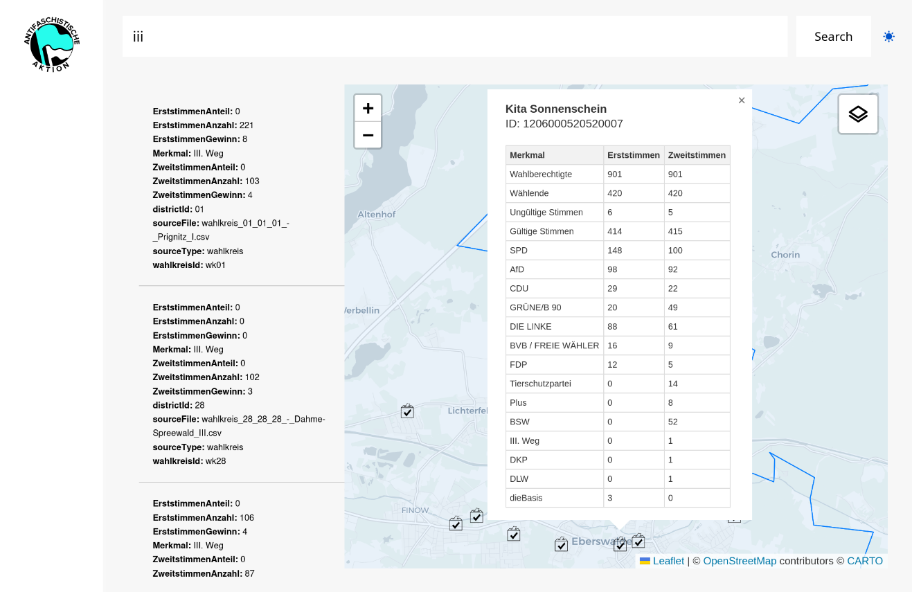
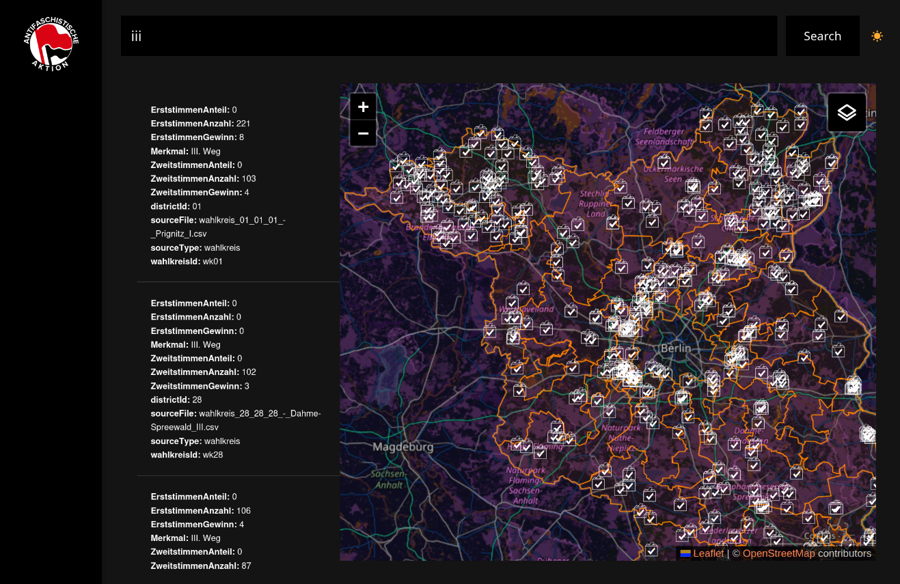

# rosa-rain
Diese Skripte laden alle Wahlergebnisse der Brandenburger Landtagswahl 2024 als CSV-Dateien, erstellen daraus SVGs und PDFs auf Basis der Vorlage. Das Frontend bietet die Möglichkeit, in den Daten mittels GraphQL-Abfragen zu suchen und zeigt Wahlkreise und Wahllokale gefiltert auf einer Open Street Map an.

## Screenshots



## Project management
https://codeberg.org/uss/rosa-rain/projects

## Getting started
1. Download latest chromium (If you want to scrape results, else start with 2.)
    
2. Clone repo and make use of a virtual environment.
```
    git clone https://codeberg.org/uss/rosa-rain.git
    cd rosa-rain
    
    python3 -m venv venv
    source venv/bin/activate
```

3. 'pip install -r requirements.txt'

```
    aiofiles: For asynchronous file operations.
    beautifulsoup4: For web scraping and parsing HTML.
    CairoSVG: For converting SVG files to other formats like PNG or PDF.
    Flask: A popular web framework for building web applications.
    graphene: A library for building GraphQL APIs.
    Hypercorn: An ASGI server to run your async web application.
    lxml: A fast XML and HTML parsing library, often a dependency of beautifulsoup4.
    numpy: A fundamental package for scientific computing with Python.
    pandas: Used for data manipulation and analysis.
    pillow: For image processing.
    python-dotenv: To manage environment variables.
    Quart: An asyncio-based web framework, often used with Hypercorn.
    requests: For making HTTP requests.
    selenium: For web automation and testing.
    trio: An asynchronous I/O library.
    webdriver-manager: To automatically manage web browser drivers for Selenium.
```

## Run app.py with hypercorn
App will be exposed on 0.0.0.0:5000
```
    hypercorn app:app --workers 2
```

## Run rosa-vote.py
Get all the election data from the official government website.
```
    python rosa-vote.py
```

## Run rosa-rain.py
If you want to output all pdf flyers, just run:
```
    python rosa-rain.py
```

## Geolocate polling places
To geolocate all polling places you will need a geocode.maps.co api key in a .env file
```
    GEOCODE_API_KEY=
```

### Run geocode.py
```
    python geocode.py
```

### Chrome driver
If you have problems with your chromdriver check:
```
    chromium_driver_path = "/usr/bin/chromedriver"
```

## API paths
GET:
http://0.0.0.0:5000/api/polling-places

POST:
http://0.0.0.0:5000/graphql

## CSV structure e.g.
```
Merkmal_Unnamed: 0_level_1;Erststimmen_Anzahl;Erststimmen_Anteil;Erststimmen_Gewinn;Zweitstimmen_Anzahl;Zweitstimmen_Anteil;Zweitstimmen_Gewinn
Wahlberechtigte;5.216;-;-;5.216;-;-
Wählende;3.960;75,9 %;+126;3.96;75,9 %;+126
Ungültige Stimmen;56;1,4 %;-01;40.0;1,0 %;-05
Gültige Stimmen;3.904;98,6 %;+01;3.92;99,0 %;+05
SPD;1.191;30,5 %;+46;1.169;29,8 %;-14
AfD;1.396;35,8 %;+141;1.339;34,2 %;+112
CDU;819;21,0 %;-41;547.0;14,0 %;-62
GRÜNE/B 90;46;1,2 %;-51;72.0;1,8 %;-46
DIE LINKE;193;4,9 %;-56;73.0;1,9 %;-56
BVB / FREIE WÄHLER;213;5,5 %;-20;90.0;2,3 %;-22
FDP;25;0,6 %;-25;15.0;0,4 %;-34
Tierschutzpartei;-;-;-;60.0;1,5 %;-04
Plus;-;-;-;26.0;0,7 %;-05
BSW;-;-;-;489.0;12,5 %;+125
III. Weg;21;0,5 %;+05;10.0;0,3 %;+03
DKP;-;-;-;0.0;0,0 %;00
DLW;-;-;-;24.0;0,6 %;+06
WU;-;-;-;6.0;0,2 %;+02
```


### License
https://en.wikipedia.org/wiki/Antifa_(Germany)#/media/File:Antifalogo_alt2.svg
1930s logo of Antifaschistische Aktion

Max Gebhard (Grafiker), Max Keilson - Own work using: This photograph, own work

Logo der Antifaschistischen Aktion
Permission details
This logo image consists only of simple geometric shapes or text. It does not meet the threshold of originality needed for copyright protection, and is therefore in the public domain. Although it is free of copyright restrictions, this image may still be subject to other restrictions. See WP:PD § Fonts and typefaces or Template talk:PD-textlogo for more information.

    Public Domainhide terms
    File:Antifalogo alt2.svg
    Created: 1932
    Uploaded: 14 April 2013

| Package | License | Repository Link |
| :--- | :--- | :--- |
| aiofiles | MIT License | [https://github.com/Tinche/aiofiles](https://github.com/Tinche/aiofiles) |
| beautifulsoup4 | MIT License | [https://www.crummy.com/software/BeautifulSoup/bs4/doc/](https://www.crummy.com/software/BeautifulSoup/bs4/doc/) |
| CairoSVG | LGPL-3.0 License | [https://github.com/Kozea/CairoSVG](https://github.com/Kozea/CairoSVG) |
| Flask | BSD 3-Clause "New" or "Revised" License | [https://github.com/pallets/flask](https://github.com/pallets/flask) |
| graphene | MIT License | [https://github.com/graphql-python/graphene](https://github.com/graphql-python/graphene) |
| Hypercorn | MIT License | [https://github.com/pgjones/hypercorn](https://github.com/pgjones/hypercorn) |
| lxml | BSD 3-Clause "New" or "Revised" License | [https://github.com/lxml/lxml](https://github.com/lxml/lxml) |
| numpy | BSD 3-Clause "New" or "Revised" License | [https://github.com/numpy/numpy) |
| pandas | BSD 3-Clause "New" or "Revised" License | [https://github.com/pandas-dev/pandas](https://github.com/pandas-dev/pandas) |
| pillow | HP-1.0 License | [https://github.com/python-pillow/Pillow](https://github.com/python-pillow/Pillow) |
| python-dotenv | BSD 3-Clause "New" or "Revised" License | [https://github.com/theskumar/python-dotenv](https://github.com/theskumar/python-dotenv) |
| Quart | MIT License | [https://github.com/pallets/quart](https://github.com/pallets/quart) |
| requests | Apache-2.0 License | [https://github.com/psf/requests](https://github.com/psf/requests) |
| selenium | Apache-2.0 License | [https://github.com/SeleniumHQ/selenium](https://github.com/SeleniumHQ/selenium) |
| trio | MIT License | [https://github.com/python-trio/trio](https://github.com/python-trio/trio) |
| webdriver-manager | MIT License | [https://github.com/SergeyPirogov/webdriver_manager](https://github.com/SergeyPirogov/webdriver_manager) |


### Lib licenses:
leaflet 1.9.4 - https://github.com/Leaflet/Leaflet
BSD 2-Clause License
Copyright (c) 2010-2025, Volodymyr Agafonkin
Copyright (c) 2010-2011, CloudMade
All rights reserved.


### Landeswahlleitung Brandenburg
Alle Wahldaten sind öffentliches Sachgut der Brandenburger Bürger*innen.

Herausgeber
<pre>
        Der Landeswahlleiter des Landes Brandenburg

        Henning-von-Tresckow-Str. 9 - 13
        14467 Potsdam

        landeswahlleiter@mik.brandenburg.de
        +49 331 866-2900
        +49 331 866-2202	
</pre>
Vertretungsberechtigter: Landeswahlleiter Josef Nußbaum

Verantwortlich im Sinne des Presserechts:
<pre>
        Geschäftsstelle
        Leiterin der Geschäftsstelle
        landeswahlleiter@mik.brandenburg.de
        +49 331 8662239
</pre>
